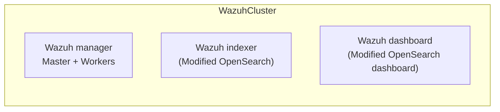

# Wazuh Kubernetes Operator

A Kubernetes operator for managing Wazuh clusters, providing a declarative way to deploy and configure Wazuh security monitoring platforms.

## Features

- **Declarative Cluster Management** - Define your entire Wazuh cluster using Kubernetes custom resources
- **Automated Deployment** - Automatically provisions Manager, Indexer, and Dashboard components
- **Rule & Decoder Management** - Manage Wazuh detection rules and log decoders as CRDs
- **OpenSearch Security CRDs** - Manage users, roles, role mappings, and tenants declaratively
- **Index Lifecycle Management** - Configure ISM policies, index templates, and snapshot policies
- **Backup & Restore** - OpenSearch snapshots and Wazuh Manager backups to S3, GCS, Azure, HDFS
- **TLS Automation** - Auto-generated certificates with hot reload support (Wazuh 4.9+)
- **High Availability** - Multi-node deployments with pod disruption budgets
- **Monitoring Ready** - Prometheus metrics and ServiceMonitor integration
- **OpenTelemetry Tracing** - Distributed tracing support for observability

## Architecture



## Quick Start

### Prerequisites

- Kubernetes 1.25+
- kubectl configured
- 16GB+ RAM recommended

### Installation with Helm

Due to CRD size, use `helm template` + `kubectl apply` instead of `helm install`:

```bash
# Install the operator
helm template wazuh-operator oci://ghcr.io/maximewewer/charts/wazuh-operator \
  --namespace wazuh-operator --create-namespace | kubectl apply -f -

# Deploy a Wazuh cluster
helm template wazuh-cluster oci://ghcr.io/maximewewer/charts/wazuh-cluster \
  --namespace wazuh | kubectl apply -f -

# Check status
kubectl get wazuhcluster -n wazuh
```

### Access Dashboard

```bash
kubectl port-forward svc/wazuh-cluster-dashboard -n wazuh 5601:5601
```

Open <https://localhost:5601> - Credentials are auto-generated in secrets.

> See [Quick Start Guide](docs/usage/getting-started/quick-start.md) for detailed instructions.

## Supported Wazuh Versions

| Wazuh           | OpenSearch         | Notes                                                                               |
| --------------- | ------------------ | ----------------------------------------------------------------------------------- |
| 4.12.x - 4.14.x | 2.19.1             | Automatic TLS certificate hot reload (file-watch).                                  |
| 4.10.x - 4.11.x | 2.16.0             |                                                                                     |
| 4.9.x           | 2.13.0             | TLS certificate hot reload via API call. Minimum version supported by the operator. |
| < 4.9.0         | Not supported      | Might work, but it hasn't been tested.                                              |

## Custom Resource Definitions

**API Group**: `resources.wazuh.com/v1`

| Category                | CRDs                                                                                                                 | Short Names                                    |
| ----------------------- | -------------------------------------------------------------------------------------------------------------------- | ---------------------------------------------- |
| **Wazuh Core**          | WazuhCluster, WazuhManager, WazuhWorker                                                                              | wc, wmgr, wwork                                |
| **Wazuh Config**        | WazuhRule, WazuhDecoder, WazuhCertificate, WazuhFilebeat                                                             | wrule, wdecoder, wzcert, wfb                   |
| **Wazuh Backup**        | WazuhBackup, WazuhRestore                                                                                            | wbak, wrest                                    |
| **OpenSearch Core**     | OpenSearchIndexer, OpenSearchDashboard                                                                               | osidxr, osdash                                 |
| **OpenSearch Security** | OpenSearchUser, OpenSearchRole, OpenSearchRoleMapping, OpenSearchActionGroup, OpenSearchTenant, OpenSearchAuthConfig | osuser, osrole, osrmap, osag, ostenant, osauth |
| **OpenSearch Index**    | OpenSearchIndex, OpenSearchIndexTemplate, OpenSearchComponentTemplate, OpenSearchPolicy, OpenSearchSnapshotPolicy    | osidx, osidxt, osctpl, osism, ossnap           |
| **OpenSearch Backup**   | OpenSearchSnapshotRepository, OpenSearchSnapshot, OpenSearchRestore                                                  | osrepo, ossnapshot, osrestore                  |

> See [CRD Reference](docs/usage/CRD-REFERENCE.md) for complete API documentation.

## Documentation

### User Guide

| Topic                                                                 | Description                       |
| --------------------------------------------------------------------- | --------------------------------- |
| [Installation](docs/usage/getting-started/installation.md)            | How to install the operator       |
| [Quick Start](docs/usage/getting-started/quick-start.md)              | Deploy your first cluster         |
| [Credentials](docs/usage/features/credentials.md)                     | Auto-generated passwords, secrets |
| [TLS Configuration](docs/usage/features/tls.md)                       | Certificate management            |
| [Monitoring](docs/usage/features/monitoring.md)                       | Prometheus integration            |
| [Backup & Restore](docs/usage/features/backup-restore.md)             | Data protection (S3, GCS, Azure, HDFS) |
| [Repository Plugins](docs/usage/features/repository-plugins.md)       | Auto plugin install & keystore    |
| [Advanced Topology](docs/usage/features/advanced-indexer-topology.md) | NodePools, dedicated roles        |
| [Examples](docs/usage/examples/)                                      | Configuration examples            |
| [Troubleshooting](docs/usage/troubleshooting/)                        | Common issues and debugging       |

### Developer Guide

| Topic                                                    | Description                |
| -------------------------------------------------------- | -------------------------- |
| [Architecture](docs/dev/architecture/operator-design.md) | Overall design             |
| [Testing Guide](docs/dev/testing/testing-guide.md)       | How to run and write tests |
| [Contributing](docs/dev/contributing/CONTRIBUTING.md)    | How to contribute          |

## Development

```bash
# Generate manifests and code
make manifests generate

# Build and test
make build test

# Build Docker image
make docker-build IMG=myregistry/wazuh-operator:dev

# Run locally
make install run
```

> See [Testing Guide](docs/dev/testing/testing-guide.md) for complete testing instructions.

## Contributing

We welcome contributions! Please see [CONTRIBUTING.md](docs/dev/contributing/CONTRIBUTING.md) for details.

## License

This project is licensed under the Apache License 2.0 - see the [LICENSE](LICENSE) file for details.

## Support

- [GitHub Issues](https://github.com/MaximeWewer/wazuh-operator/issues)
- [Wazuh Documentation](https://documentation.wazuh.com/)

## Acknowledgments

- Built with [Kubebuilder](https://book.kubebuilder.io/)
- Inspired by [opensearch-k8s-operator](https://github.com/opensearch-project/opensearch-k8s-operator)
- Based on [Wazuh](https://wazuh.com/) security platform
