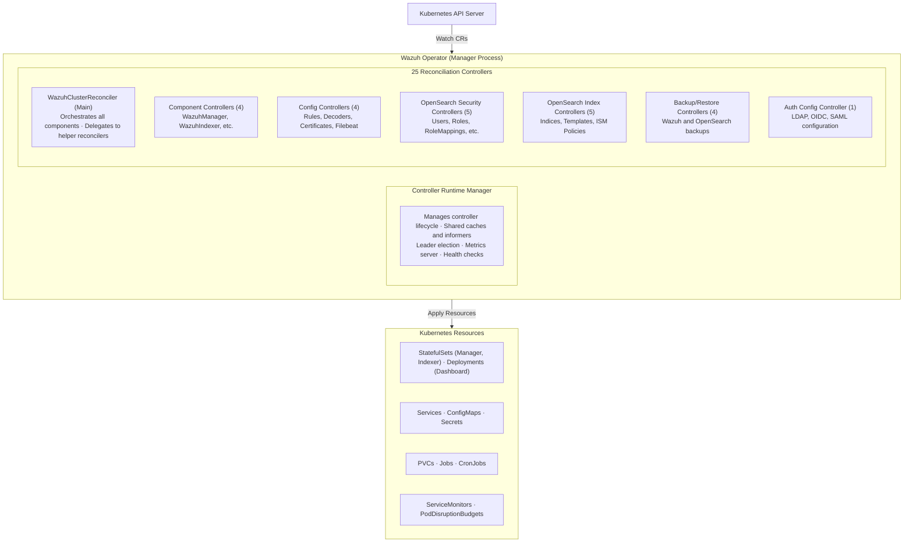
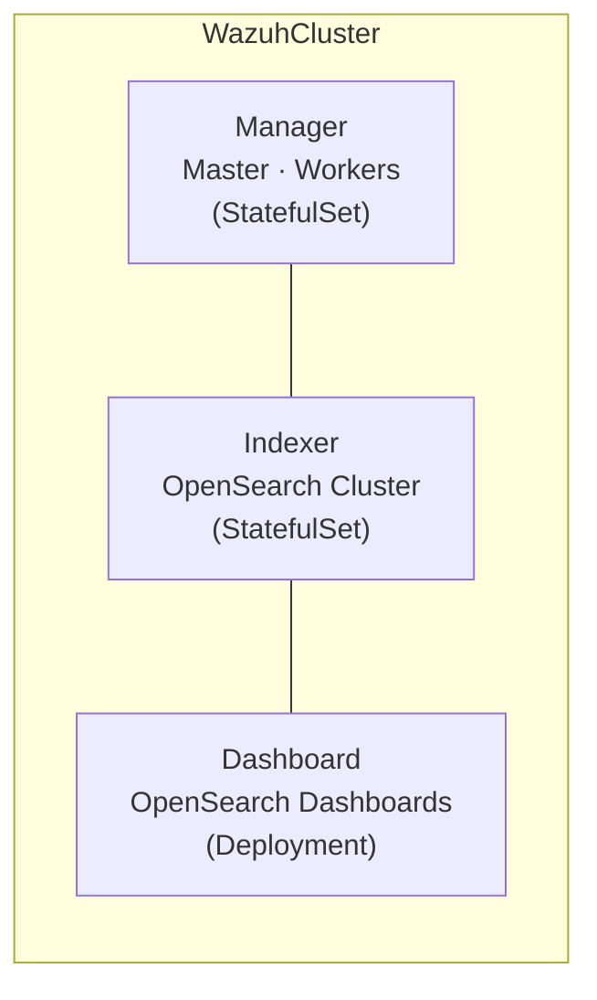
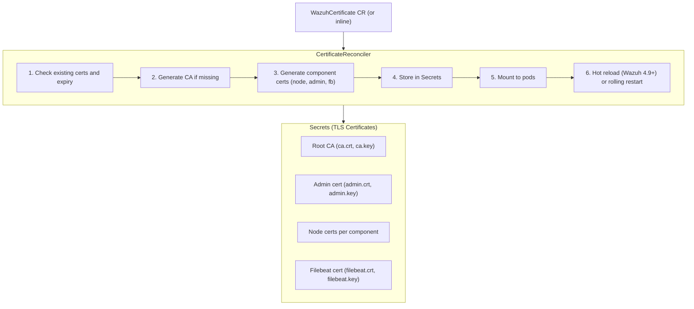
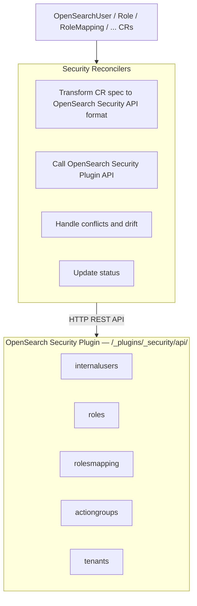
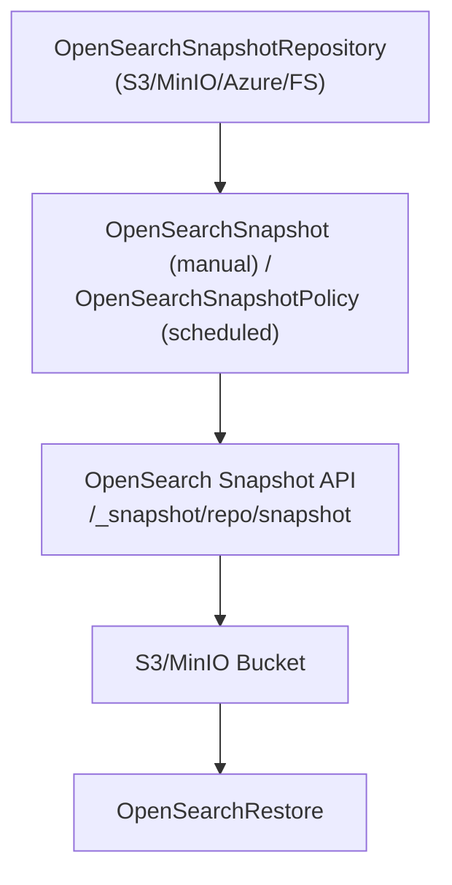
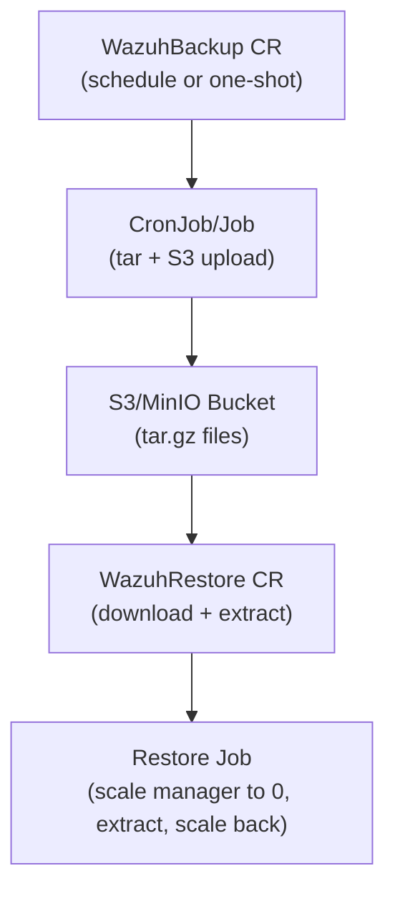
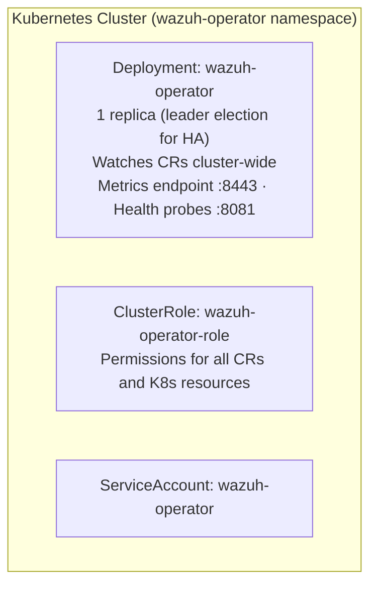
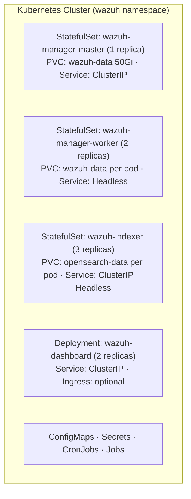

# Architecture

## Executive Summary

The Wazuh Operator is a Kubernetes operator built using the Kubebuilder framework that manages the complete lifecycle of Wazuh security monitoring platform deployments on Kubernetes. It follows the operator pattern with declarative resource management through 25 Custom Resource Definitions (CRDs) and 25 reconciliation controllers.

## Technology Stack

### Core Technologies

- **Language**: Go 1.26.0
- **Framework**: Kubebuilder v4 with controller-runtime v0.23.1
- **Kubernetes API**: client-go v0.35.1, k8s.io/api v0.35.1
- **Gateway API**: sigs.k8s.io/gateway-api v1.4.1
- **Testing**: Ginkgo v2.28.1 + Gomega v1.39.1
- **Monitoring**: Prometheus (prometheus-operator v0.89.0 APIs, prometheus/client_golang v1.23.2)
- **Tracing**: OpenTelemetry (OTLP gRPC exporter v1.40.0, otelhttp transport)
- **Cryptography**: golang.org/x/crypto v0.47.0

### Build & Deployment

- **Build Tool**: Make
- **Container**: Multi-stage Docker (golang:1.26-alpine → distroless/static:nonroot)
- **Package Manager**: Helm (charts published to GHCR)
- **Code Generation**: controller-gen v0.20.0

## Architecture Pattern

### Kubernetes Operator Pattern

The operator implements the standard Kubernetes operator pattern:

1. **Watch**: Controllers watch Custom Resources via informers
2. **Compare**: Compare desired state (CR spec) with actual state (running resources)
3. **Act**: Reconcile differences by creating/updating/deleting Kubernetes resources
4. **Update**: Report status back to CR
5. **Requeue**: Schedule next reconciliation

### Reconciliation Loop



## Layered Architecture

### Layer 1: API Layer (`api/v1/`)

**Purpose**: Define Custom Resource schemas

**Versions**:

- `v1` - Storage version (primary API)
- `v1` - Still served for backward compatibility

**Components**:

- 25 CRD type definitions
- Validation markers (Kubebuilder)
- Status subresources
- Short names and categories

**Key Files**:

- `wazuhcluster_types.go`: Main orchestrating CRD
- `*_types.go`: Individual CRD definitions
- `common_types.go`, `shared_types.go`: Shared types
- `groupversion_info.go`: API group registration

### Layer 2: Controller Layer (`controllers/`)

**Purpose**: Main reconciliation entry points

**Pattern**: Thin controllers that delegate to helper reconcilers

**Responsibilities**:

- Watch Custom Resources
- Handle finalizers and deletion
- Delegate to business logic reconcilers
- Update status conditions
- Manage requeue intervals

**Key Controller**: `WazuhClusterReconciler`

- Orchestrates all components
- Manages certificate lifecycle
- Coordinates drain operations
- Integrates monitoring

### Layer 3: Business Logic Layer (`internal/`)

**Purpose**: Domain-specific reconciliation logic

**Organization**:

```text
internal/
├── wazuh/                  # Wazuh-specific logic (NO cross-domain imports)
│   ├── reconciler/         # Helper reconcilers (cluster, manager, worker, rules, etc.)
│   ├── config/             # Configuration generation (ossec.conf)
│   ├── builder/            # Resource builders (statefulsets, services, configmaps, etc.)
│   ├── drain/              # Drain strategy (ManagerDrainer, rollback, retry)
│   ├── health/             # Health checks
│   └── validation/         # Wazuh-specific validation
├── opensearch/             # OpenSearch-specific logic (NO cross-domain imports)
│   ├── reconciler/         # Helper reconcilers (indexer, dashboard, security CRDs, etc.)
│   ├── api/                # OpenSearch REST API clients
│   ├── config/             # Configuration generation (opensearch.yml, auth configs)
│   ├── securityconfig/     # Security config structures
│   ├── security/           # Security synchronization
│   ├── builder/            # Resource builders (statefulsets, deployments, etc.)
│   ├── drain/              # Indexer drain operations
│   ├── health/             # Health checks
│   ├── hotreload/          # Hot reload support
│   └── validation/         # OpenSearch-specific validation
├── certificates/           # TLS certificate management (cross-cutting)
│   ├── reconciler/         # CertificateReconciler + hot reload logic
│   ├── common/             # Shared cert utilities
│   ├── opensearch/         # OpenSearch cert generation
│   ├── wazuh/              # Wazuh cert generation
│   └── sans/               # SAN management
├── networking/             # Networking (cross-cutting, shared by opensearch+wazuh)
│   ├── reconciler/         # GatewayReconciler, IngressReconciler
│   └── builder/            # HTTPRoute, TCPRoute, UDPRoute, Ingress builders
├── shared/                 # Cross-cutting shared concerns
│   ├── affinity/           # Anti-affinity builders (used by both domains)
│   ├── pdb/                # PodDisruptionBudget builders (used by both domains)
│   ├── drain/              # Drain state machine + detection (used by both domains)
│   ├── config/             # Shared configuration utilities
│   ├── storage/            # Storage utilities
│   └── patch/              # Change detection (hash, drift)
├── validation/             # CRD validation (cluster, opensearch, wazuh, password)
├── metrics/                # Prometheus metrics
├── monitoring/             # ServiceMonitor reconciliation
├── telemetry/              # OpenTelemetry tracing
├── adapters/               # External system adapters
├── secrets/                # Secret management utilities
└── utils/                  # Internal utilities (k8s helpers, conditions, merge)
```

**Reconciler Pattern**:

1. Fetch target cluster/component
2. Validate spec
3. Build desired Kubernetes resources
4. Apply resources (create/update)
5. Handle drift detection
6. Update status
7. Return requeue interval

### Layer 4: Resource Builder Layer

**Purpose**: Generate Kubernetes resources from CR specs

**Pattern**: Builder pattern with fluent interface

**Example**:

```go
// StatefulSet builder
builder := statefulsets.NewManagerBuilder(name, namespace).
    WithVersion(version).
    WithReplicas(replicas).
    WithResources(resources).
    WithStorage(storageSize).
    WithConfigMap(configMapName).
    WithSecrets(secretNames).
    Build()
```

**Builders**:

- **StatefulSets**: Manager, Worker, Indexer
- **Deployments**: Dashboard
- **Services**: ClusterIP, headless
- **ConfigMaps**: ossec.conf, opensearch.yml, filebeat.yml
- **Secrets**: TLS certs, credentials
- **PVCs**: Data storage
- **Jobs/CronJobs**: Backups, restores, init tasks

### Layer 5: Cross-Cutting Concerns

**Networking** (`internal/networking/`):

- Gateway API reconciliation (HTTPRoute, TCPRoute, UDPRoute)
- Ingress reconciliation (networkingv1.Ingress)
- Shared by both wazuh and opensearch domains

**Certificates** (`internal/certificates/`):

- CertificateReconciler with hot reload support
- Certificate generation per domain (opensearch, wazuh)
- SAN management

**Shared** (`internal/shared/`):

- Anti-affinity builders (manager, indexer, dashboard)
- PodDisruptionBudget builders
- Drain state machine (used by both wazuh and opensearch drain)
- Change detection and patch utilities

### Layer 6: Validation Layer (`internal/validation/`)

**Purpose**: CRD validation logic

**Types**:

- **Structural validation**: Kubebuilder markers
- **Semantic validation**: Business rule validation in `internal/validation/`
- **Cross-field validation**: Field dependencies
- **Domain-specific**: `internal/wazuh/validation/`, `internal/opensearch/validation/`

### Layer 7: Public API Layer (`pkg/`)

**Purpose**: Stable public packages (importable externally, NO `internal/` imports)

**Packages**:

- **`pkg/constants/`**: Port definitions, default values, backup constants
- **`pkg/config/`**: Operator runtime configuration
- **`pkg/dns/`**: Cluster domain resolution
- **`pkg/logging/`**: Structured logging setup
- **`pkg/version/`**: Operator version and build metadata
- **`pkg/versions/`**: Wazuh↔OpenSearch version mapping, hot reload support detection

## Data Architecture

### Custom Resource Definitions (25 CRDs)

**API Group**: `resources.wazuh.com/v1` ()

**Categories**:

1. **Wazuh Core** (5): WazuhCluster, WazuhManager, WazuhWorker, OpenSearchIndexer, OpenSearchDashboard
2. **Wazuh Config** (4): WazuhRule, WazuhDecoder, WazuhCertificate, WazuhFilebeat
3. **Wazuh Backup** (2): WazuhBackup, WazuhRestore
4. **OpenSearch Security** (6): OpenSearchUser, OpenSearchRole, OpenSearchRoleMapping, OpenSearchActionGroup, OpenSearchTenant, OpenSearchAuthConfig
5. **OpenSearch Index** (5): OpenSearchIndex, OpenSearchIndexTemplate, OpenSearchComponentTemplate, OpenSearchISMPolicy, OpenSearchSnapshotPolicy
6. **OpenSearch Backup** (3): OpenSearchSnapshotRepository, OpenSearchSnapshot, OpenSearchRestore

**Common Patterns**:

- `spec`: Desired state (user-defined)
- `status`: Observed state (operator-managed)
- `conditions`: Standard K8s conditions (Ready, Progressing, Degraded)
- References: Cross-CR references (clusterRef, managerRef, etc.)

### Status Reporting

**Standard Conditions**:

```go
type Condition struct {
    Type               string      // Ready, Progressing, Degraded, Failed
    Status             string      // True, False, Unknown
    ObservedGeneration int64       // Last observed CR generation
    LastTransitionTime metav1.Time // When condition changed
    Reason             string      // Machine-readable reason
    Message            string      // Human-readable message
}
```

**Phase Model**:

- `Pending`: Resource created, reconciliation not started
- `Progressing`: Resources being created/updated
- `Ready`: All resources healthy
- `Degraded`: Some resources unhealthy
- `Failed`: Unrecoverable error

## Component Architecture

### WazuhCluster Component

The WazuhCluster CR orchestrates three main components:



**Manager**:

- Master node (1 replica StatefulSet)
- Worker nodes (N replicas StatefulSet)
- Wazuh core services
- API endpoint
- Agent enrollment

**Indexer**:

- OpenSearch cluster (1-N replicas)
- Log storage and indexing
- Advanced topology with NodePools
- Dedicated node roles (master, data, ingest, ml, coordinating)

**Dashboard**:

- Web UI (1-N replicas Deployment)
- Visualization and analysis
- User management interface

### Certificate Management Architecture



**Features**:

- Auto-generation with RSA 2048-bit keys
- Automatic renewal (N days before expiry)
- Hot reload without pod restart (Wazuh 4.9+)
- Non-blocking rollouts (production mode)
- Certificate test mode (short-lived certs for testing)

### OpenSearch Security Integration



### Backup & Restore Architecture

**OpenSearch Snapshots** (via OpenSearch Snapshot API):



**Wazuh Manager Backups** (via Jobs to S3/MinIO):



## Deployment Architecture

### Operator Deployment



### Managed Cluster Deployment



## Testing Strategy

### Unit Tests

- **Framework**: Standard Go testing
- **Coverage**: Core business logic, utilities
- **Location**: `*_test.go` files alongside source

### Integration Tests

- **Framework**: Ginkgo + Gomega
- **Tool**: envtest (embedded etcd + kube-apiserver)
- **Scope**: Controller reconciliation logic
- **Location**: `controllers/*_test.go`

### End-to-End Tests

- **Framework**: Ginkgo + Gomega
- **Cluster**: Real Kubernetes cluster
- **Scope**: Complete workflows (deploy, scale, upgrade, backup/restore)
- **Location**: `test/e2e/`

### Certificate Testing

- **Test Mode**: Short-lived certificates (5 min validity)
- **Scenario**: Certificate renewal, hot reload, rollout coordination
- **Documentation**: `docs/dev/testing/certificate-renewal-scenarios.md`

## Security Considerations

### RBAC

- Operator uses ClusterRole with least-privilege permissions
- Separate ServiceAccount per operator instance
- No cluster-admin required

### Secrets Management

- TLS certificates stored in Secrets
- Credentials auto-generated with strong randomness
- No default/hardcoded passwords

### Network Security

- All inter-component communication over TLS
- ConfigMaps for non-sensitive config
- Secrets for sensitive data

### Container Security

- Distroless base image (no shell, no package manager)
- Non-root user (UID 65532)
- Read-only root filesystem where possible
- Dropped capabilities

## Monitoring & Observability

### Metrics

- **Exporter**: Prometheus client_golang
- **Endpoint**: HTTPS :8443/metrics (or HTTP :8080)
- **Metrics**:
  - `wazuh_reconcile_total`: Reconciliation count
  - `wazuh_reconcile_errors_total`: Error count
  - `wazuh_reconcile_duration_seconds`: Reconciliation duration
  - Standard controller-runtime metrics

### ServiceMonitors

- Optional Prometheus Operator integration
- Auto-created for Manager, Indexer, Dashboard
- Custom labels for targeting

### Logging

- **Framework**: zap (structured logging)
- **Levels**: Info, Debug, Trace
- **Format**: JSON for production

### Distributed Tracing

- **Framework**: OpenTelemetry SDK
- **Exporter**: OTLP gRPC
- **Instrumented Components**:
  - Wazuh API calls (HTTP transport wrapper)
  - OpenSearch API calls (HTTP transport wrapper)
  - OpenSearch HTTP adapter calls
- **Configuration**: Environment variables (disabled by default)
  - `OTEL_EXPORTER_OTLP_ENDPOINT`: OTLP endpoint (tracing disabled when not set)
  - `OTEL_EXPORTER_OTLP_INSECURE`: Use insecure connection
  - `OTEL_SERVICE_NAME`: Service name (default: `wazuh-operator`)
  - `OTEL_SERVICE_VERSION`: Service version

### Health Checks

The operator exposes health endpoints on port `8081` (configurable via `operator.healthProbe.port`).

**Liveness** (`/healthz`):

| Check | Description |
|-------|-------------|
| `ping` | Always passes if the process is running |

**Readiness** (`/readyz`):

| Check | Description |
|-------|-------------|
| `ping` | Always passes if the process is running |
| `informer-sync` | Passes once the Kubernetes informer cache has fully synced |
| `reconcile-watchdog` | Passes while the reconcile loop has run within the last 5 minutes |
| `leader-election` | Passes once this instance is the elected leader (only registered when `--leader-elect` is enabled) |

Use the `?verbose` query parameter to see individual check results:

```bash
kubectl port-forward -n wazuh-operator deploy/wazuh-operator-controller-manager 8081:8081
curl http://localhost:8081/readyz?verbose
```

## Performance Considerations

### Caching

- Shared informer caches (controller-runtime)
- Watch-based updates (no polling)
- Filtered watches where possible

### Reconciliation

- Requeue intervals based on state:
  - Normal: 30s
  - Rollout: 5s
  - Drain: 10s
- Exponential backoff on errors

### Resource Management

- Operator: ~100-200MB RAM, minimal CPU
- Managed clusters: Depends on size and workload

## Extensibility

### Adding New CRDs

1. Define types in `api/v1/`
2. Generate code and manifests
3. Create controller
4. Add reconciler logic
5. Update RBAC

### Custom Reconcilers

- Implement `reconcile.Reconciler` interface
- Register with controller-runtime manager
- Add to main.go setup

### Webhooks

Two webhooks are implemented:

- **WazuhCluster** (`api/v1/wazuhcluster_webhook.go`): Validation webhook (spec validation, mode exclusion, TLS config) and defaulting webhook (TLS defaults, replica defaults)
- **OpenSearchAuthConfig** (`api/v1/opensearchauthconfig_webhook.go`): Validation webhook for authentication configuration
